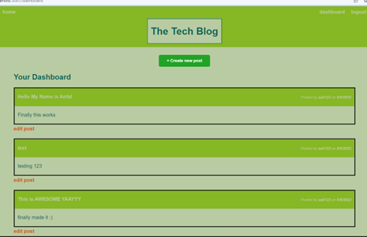
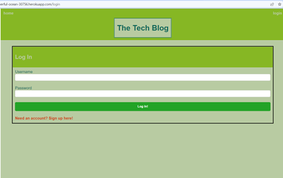

# Tech-Blog - MVC

# Description

This application is a CMS style tech blog that allows various different users to create an account and post blog posts. Users can also edit and delete their own posts. It also allows them to comment on posts from other users.The site is deployed on Heroku.The site follows MVC paradigm in its architectural structure.

# technologies 
Technologies used are: Express.js, Handlebars, Sequelize, Express-session, MySQL, BCrypt.

# Deployment Link 

https://powerful-ocean-30756.herokuapp.com/login

# images 

